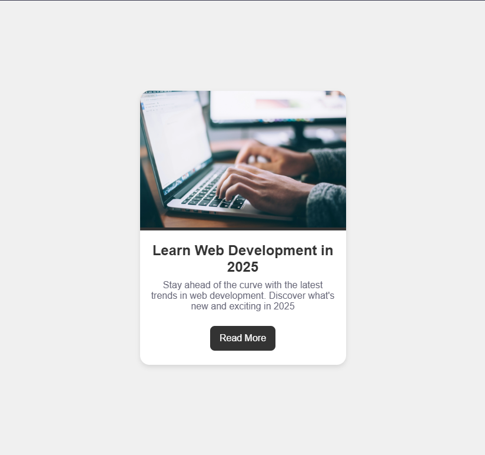

# Blog Post Card

Project developed in the **Certified Full Stack Developer** course from freeCodeCamp.

## Objective
To design a blog post card using HTML and CSS to practice concepts like background-color, border-radius, margins, paddings, and more.

## Technologies
- HTML5
- CSS

## Screenshots
