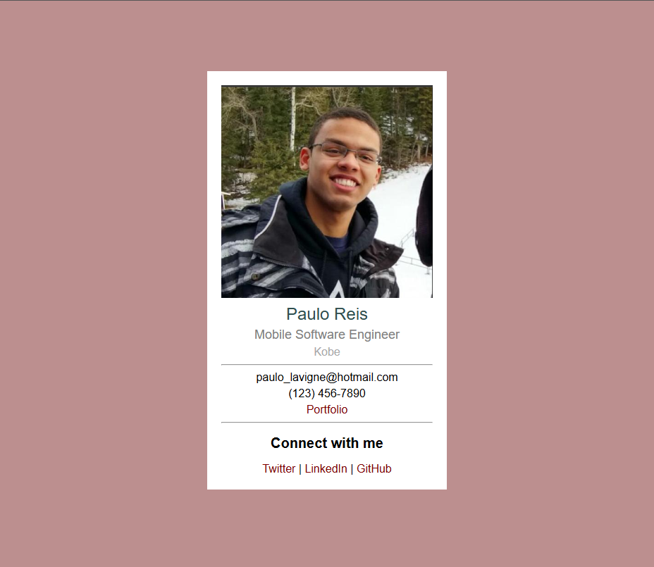

# Business Card

Project developed in the **Certified Full Stack Developer** course from freeCodeCamp.

## Objective
To create a business card and style it using CSS to practice style properties like color, font-size, text-align, and more.

## Technologies
- HTML5
- CSS

## Screenshots
