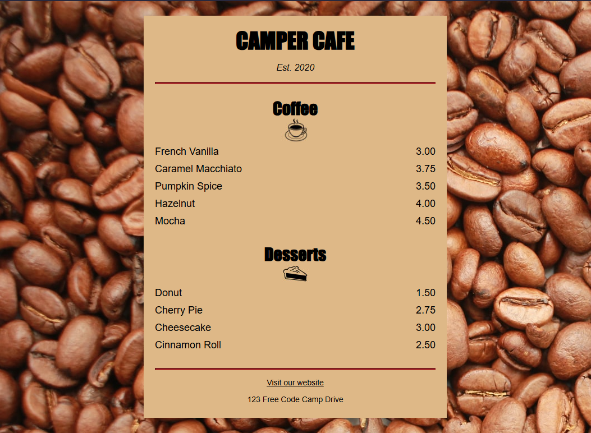

# Cafe Menu

Project developed in the **Certified Full Stack Developer** course from freeCodeCamp.

## Objective
To style a web page using CSS for the first time in the course.

## Technologies
- HTML5
- CSS

## Screenshots
