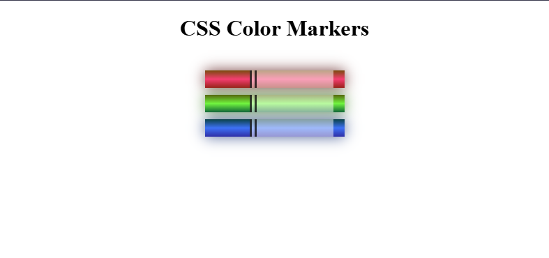

# Color Markers

Project developed in the **Certified Full Stack Developer** course from freeCodeCamp.

## Objective
To practice different ways to set color values and how to pair colors with each other.

## Technologies
- HTML5
- CSS

## Screenshots
