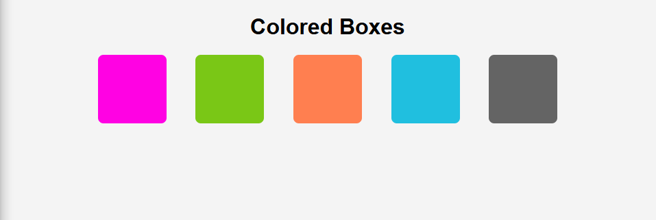

# Colored Boxes

Project developed in the **Certified Full Stack Developer** course from freeCodeCamp.

## Objective
To create a color grid and practice adding background colors to the grid items using hex codes, RGB, and predefined color names.

## Technologies
- HTML5
- CSS

## Screenshots
