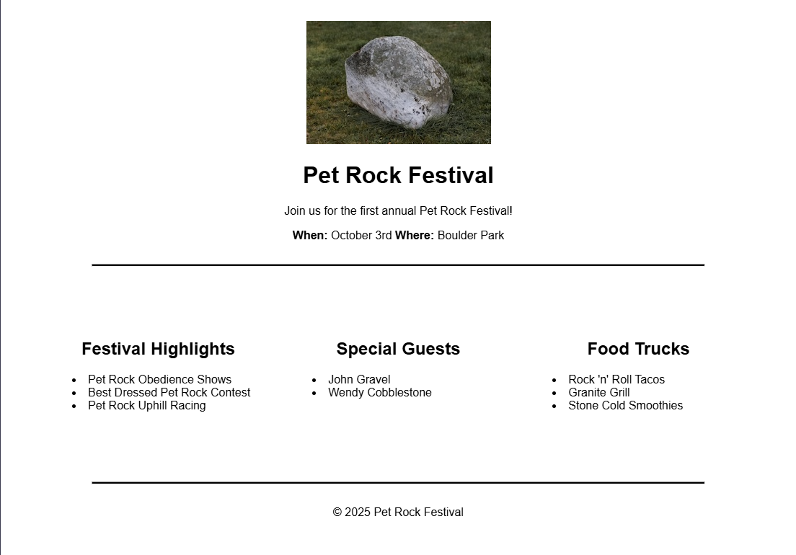

# Event Flyer

Project developed in the **Certified Full Stack Developer** course from freeCodeCamp.

## Objective
To practice aligning elements using absolute and relative CSS.

## Technologies
- HTML5
- CSS

## Screenshots
