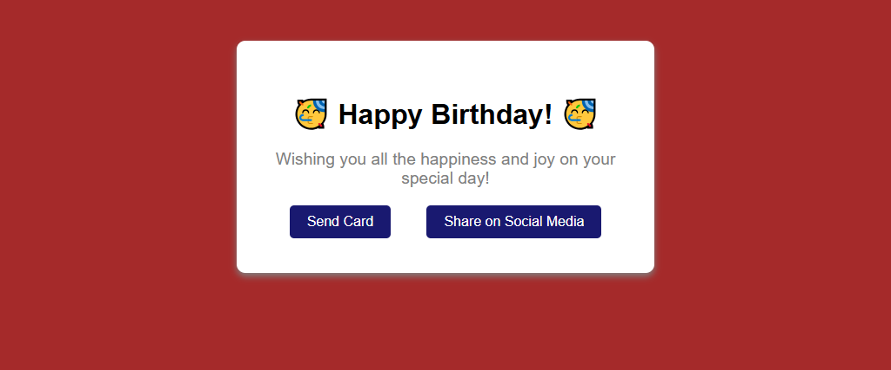
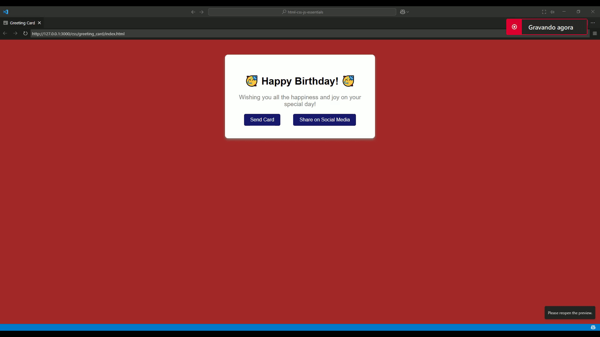

# Greeting Card

Project developed in the **Certified Full Stack Developer** course from freeCodeCamp.

## Objective
To practice working with the different types of pseudo-classes.

## Technologies
- HTML5
- CSS

## Screenshots

