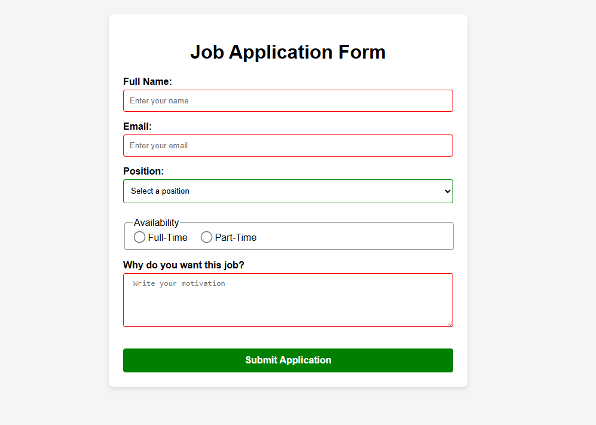

# Job Application Form

Project developed in the **Certified Full Stack Developer** course from freeCodeCamp.

## Objective
To build a job application form and style it using pseudo-classes to practice concepts like :hover, :active, :focus, and more.

## Technologies
- HTML5
- CSS

## Screenshots
