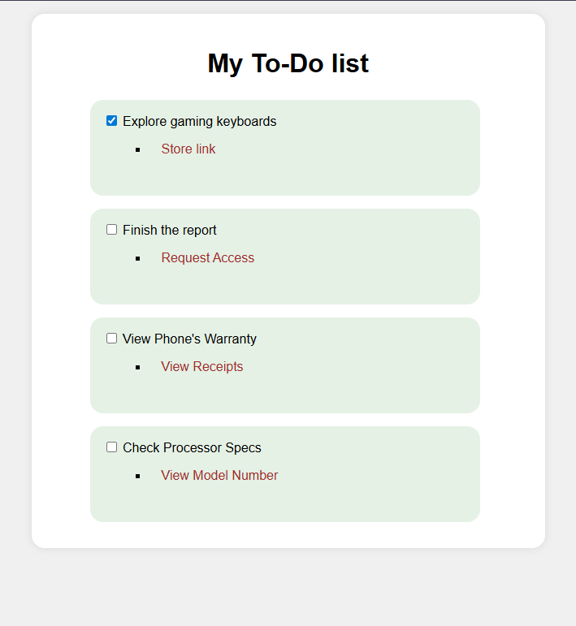

# Styled To-Do List

Project developed in the **Certified Full Stack Developer** course from freeCodeCamp.

## Objective
To build a To-Do list and apply different styles to the links to practice style properties like text-decoration, list-style-type and how to change styles on hover or click.

## Technologies
- HTML5
- CSS

## Screenshots
