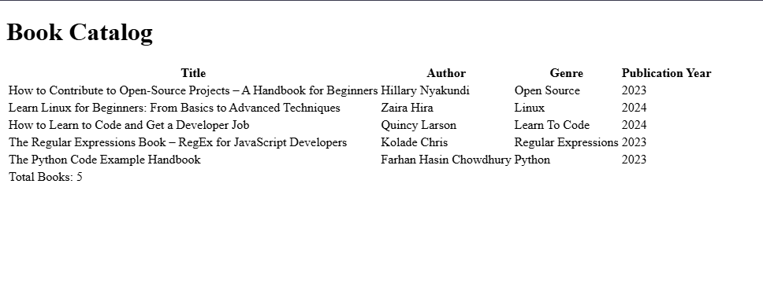

# Book Catalog

Project developed in the **Certified Full Stack Developer** course from freeCodeCamp.

## Objective
To review HTML tables by building a book information table utilizing the different table components like the thead, tbody, th, tr, and td elements.

## Technologies
- HTML5

## Screenshots
