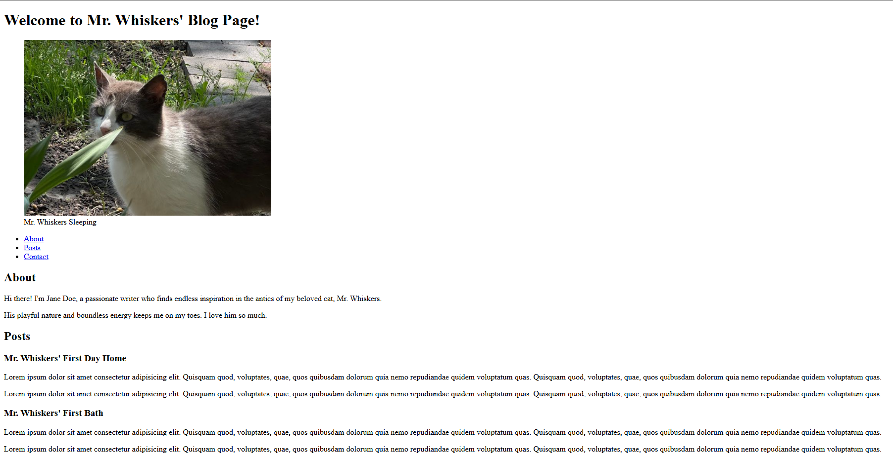

# Mr. Whiskers' Blog

Project developed in the **Certified Full Stack Developer** course from freeCodeCamp.

## Objective
Build an HTML only blog page using semantic elements including the main, nav, article and footer elements.

## Technologies
- HTML5

## Screenshots
