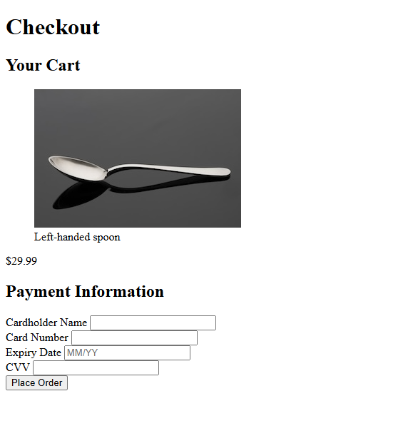

# Checkout Page

Project developed in the **Certified Full Stack Developer** course from freeCodeCamp.

## Objective
To create an accessible checkout page practicing concepts like alt attributes and ARIA roles.

## Technologies
- HTML5

## Screenshots
