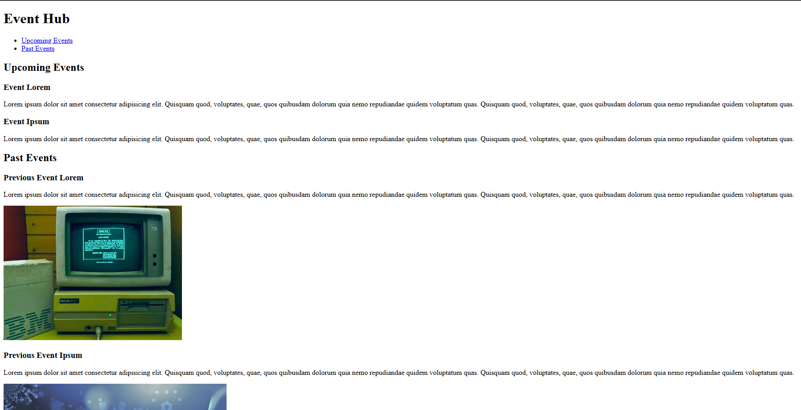

# Event Hub

Project developed in the **Certified Full Stack Developer** course from freeCodeCamp.

## Objective
Build an event hub and review semantic elements like header, nav, article, and more.

## Technologies
- HTML5

## Screenshots
