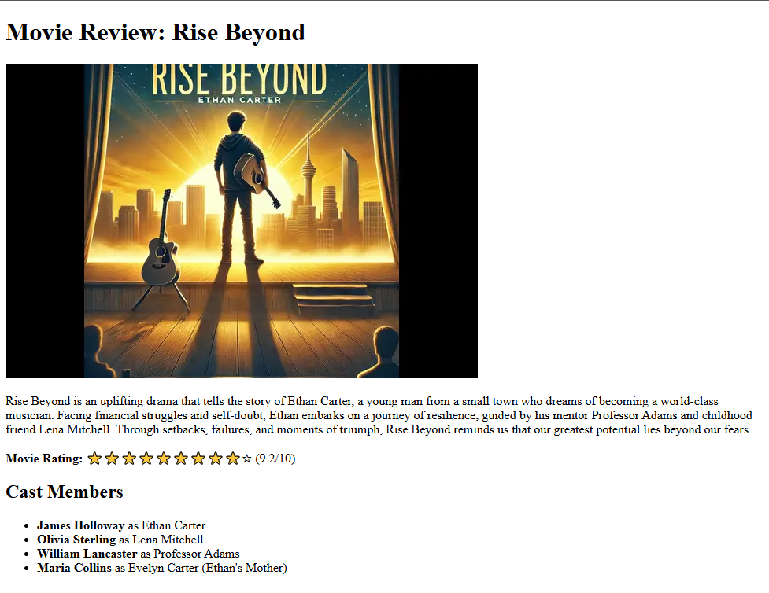

# Movie Review

Project developed in the **Certified Full Stack Developer** course from freeCodeCamp.

## Objective
To practice concepts like semantic HTML, alt attributes, accessible lists, and hiding decorative content from screen readers using aria-hidden.

## Technologies
- HTML5

## Screenshots
