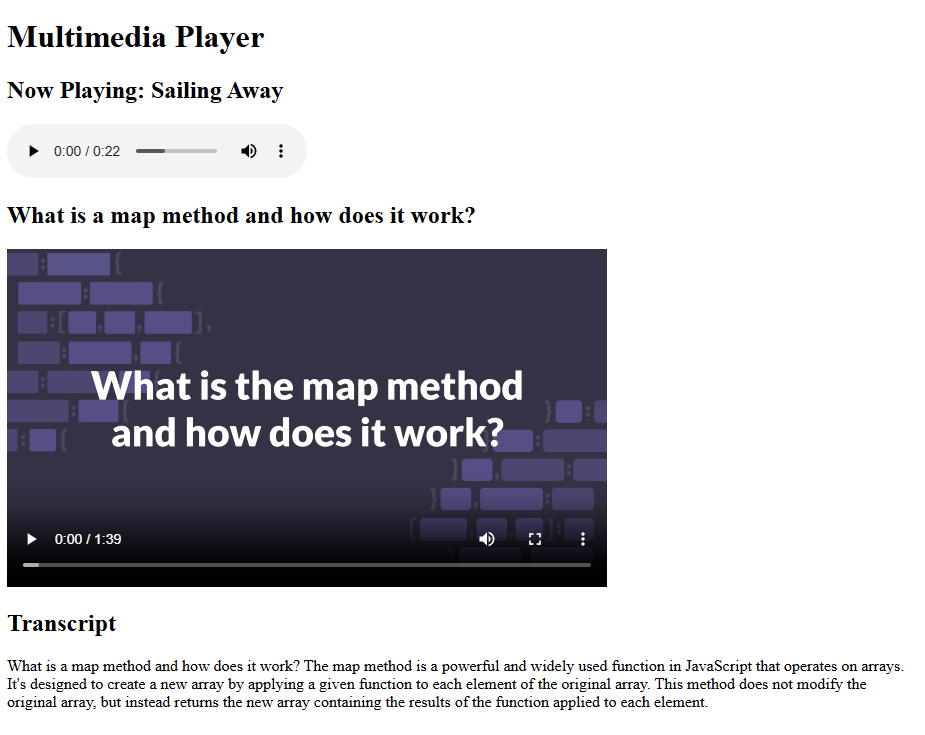

# Multimedia Player

Project developed in the **Certified Full Stack Developer** course from freeCodeCamp.

## Objective
To practice working with the audio and video elements, the controls attribute, and the aria-label attribute.

## Technologies
- HTML5

## Screenshots
