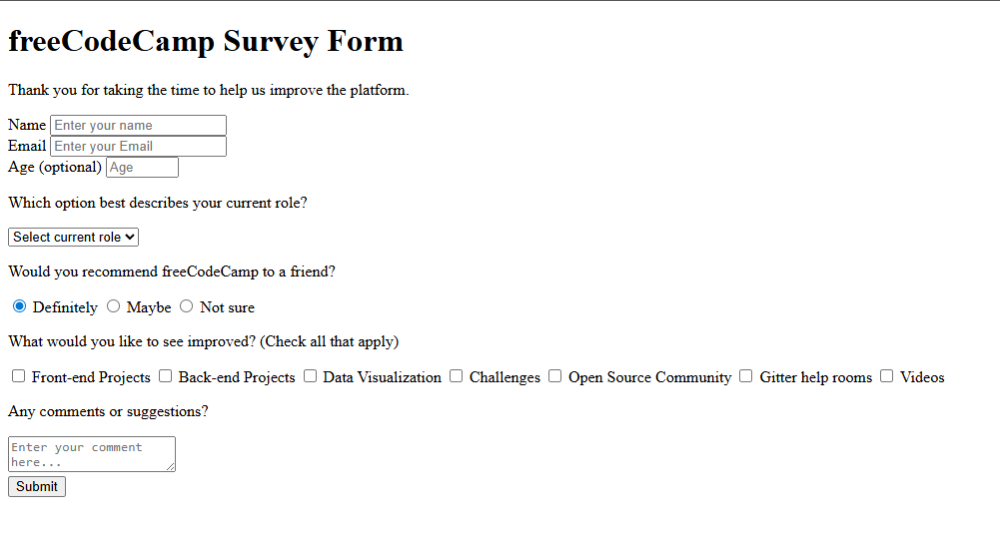

# freeCodeCamp Survey Form

Project developed in the **Certified Full Stack Developer** course from freeCodeCamp.

## Objective
To practice and reinforce HTML form fundamentals by creating a survey form utilizing the <label> element, various input types, the required attribute, and other key features.

## Technologies
- HTML5

## Screenshots
